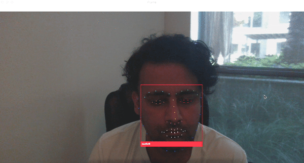
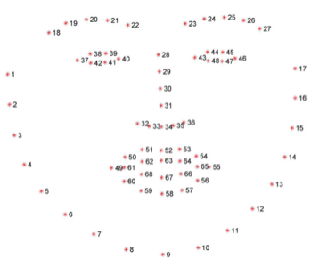
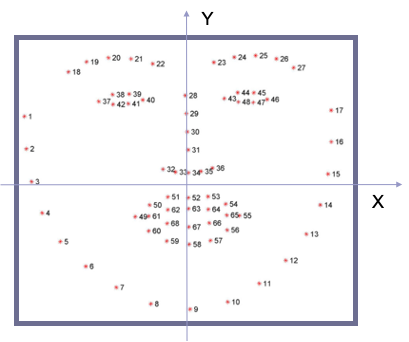

# Facial Recognition using Feature Landmarks 

Facial recognition has become a very hot topic as of late. The underlying algorithm involves 1) facial feature detection using neural networking and 2) feature classification using traditional supervised and unsupervised machine learning algorithms. The goal of this project is to take a set of images, detect facial features, and then apply traditional classification techniques to identify the individuals in the picture. This project will explore facial recognition.

A convolutional neural network will be used to detect feature landmarks from faces. The dlib library will be leveraged with an ensemble of regression trees for this purpose. The landmarks will lead to a facial detection (i.e. bounding box around the face) which encompasses these landmark features. These faces will then be encoded into a 128-dimenstional feature space (based on the facenet whitepaper). I will then compare this encoding with known encodings from a trained set of faces using both a Support Vector Machine and a K-Nearest Neighbor machine learning algorithm to predict a face. 


**Follow [this guide](#getting-started) and you will be able to train and run your own facial recognition software:**




## Getting Started

These instructions will allow you to run your own live-stream object detection.

* [Train Facial Landmark Detector](#train-facial-landmark-detector)
* [Run Facial Landmark Detection](#run-facial-landmark-detection)
* [Train Facial Recognition Classifier](#train-facial-recognition-classifier)
* [Run Facial Recognition](#run-facial-recogniton)

### Prerequisites

* python3
* opencv-python
* imglab
* imutils
* dlib

### Clone Repository

This codebase has been tested on RHEL7 and MacOS-PyCharm

1. Clone this repository
    ```
    https://github.com/nashebismaily/deep-learning-facial-recognition.git
    ```
2. Install packages
    ```
    pip3 install opencv-python
    pip3 install imutils
    pip3 install dlib
    
    yum install labelimg
    ```

### Train Facial Landmark Detector

1. Download a set of images which contain faces that you want to train your landmark detector on:

    Place yolov3.weights into this folder:

    ```
    deep-learning-facial-recognition/face_landmarks/data/faces
    ```

2. Use [ImgLab](https://imglab.in/) to annotate facial landmarks, saving as dlib points xml

   The facial landmark annotations should follow the 68-point guide below:
   
   
  
3. Update the landmarks.cfg with annotated xml information:
   
   ```
    landmarks_training_xml=data/faces/labels_faces_train.xml
    landmarks_testing_xml=data/faces/labels_faces_test.xml
   ```

4. Run the Convolutional Network to train your landmark detector:

   ```
    python3 face_landmark/train_predictor.py
   ```  
 
### Run Facial Landmark Detection

1. Ensure the display configuration is enabled in landmarks.cfg

    ```
    [display]
    landmarks=1
    face_frame=1
    overlay=1
    ```
    
    **Note:** The overlay display will add a specified filter in the form of a hat above your head.

2. Run the landmark detection:

   ```
    python3 face_landmark/landmarks_from_camera.py
   ```  
   
   ** Note**: The bounding box is calculated using the min/max coordinates from the facial features
   
   
   
### Train Facial Recognition Classifier 
 
1. Add training images 

   Training images need to be in a subfolder, where the name of that folder represents the class/label.
   
   The default training directory is specified in the recognition.cfg file
  
   
    ```
    [training]
    train_image_dir=images/train
    ```  
   
   You will see a **nasheb** subfolder with an image of myself.
   All of the images inside that folder will therefore be trained with the label/class **nasheb**
 
### Run Facial Recognition

1. Copy the face_landmarks.dat output model from the [Train Facial Landmark Detector] into the facial recognition models directory

   ```
    cp face_landmarks/models/face_landmarks.dat face_recognition/models/

   ```

2. Download Pre-Trained FaceNET Encoding Model

    [FaceNET_Encoding](https://srv-file22.gofile.io/download/OmhUTs/darknet53.conv.74)
    
    Place the resnet_face_encoding.dat into this folder:

    ```
    deep-learning-facial-recognition/face_recognition/models/
    ```

3. Run the live stream Facial Recognition

   ```
    python3 face_recognition/detect_faces_camera.py
   ```  


### OPTIONAL: Fine Tune the Landmark Detection

Fine tune the 4-dimensional blob from the input frame:

```
deep-learning-facial-recognition/face_landmarks/config/landmarks.cfg

[training]
oversampling_amount=300
nu=0.05
tree_depth=2
```

### OPTIONAL: Fine Tune the Facial Recognition

Fine tune the frame capture rate:

```
deep-learning-facial-recognition/face_recognition/config/recognition.cfg

[training]
n_neighbors=0   # If set to 0, the algorithm will auto-determine the appropriate number of neighbors
knn_algorithm=ball_tree
```

## Built With

* [dlib](http://dlib.net/)


## Authors

* **Nasheb Ismaily** 

## License

This project is licensed under the MIT License - see the [LICENSE.md](LICENSE.md) file for details
